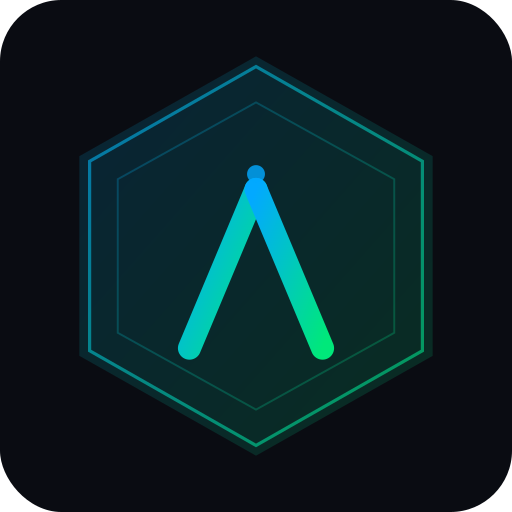

<p align="center">
  
</p>

# AniTrack

Sync your anime list between **AniList** and **MyAnimeList (MAL)**. AniTrack shows what's out of sync between the two platforms and lets you push changes in one click — with full **two-way sync** when both accounts are connected.

Built with Python + Flask. Deployed on Vercel.

---

## Features

- View your AniList anime list (watching + planned) with airing countdowns
- Shows your current episode progress on each watching card
- Connect MAL via OAuth 2.0 PKCE
- Connect AniList via OAuth 2.0 for two-way sync
- Diff your AniList vs MAL lists — see what's missing or out of sync
- **Two-way sync**: higher value wins (e.g. MAL ep 3 vs AniList ep 1 → both become ep 3)
- Auto-sync everything at once or apply changes one by one
- Dark / light theme
- Smooth sliding pill navbar animation
- Oneko pixel cat that follows your cursor (toggle in Settings)
- Navbar glass blur toggle in Settings
- Clean footer with attribution

---

## How sync works

| Field    | Rule                                      |
|----------|-------------------------------------------|
| Progress | `max(AniList, MAL)` — higher episode wins |
| Score    | Higher score wins; 0 is ignored           |
| Status   | More progressed status wins (Completed > Watching > Planning) |

When only MAL is connected, changes are pushed to MAL only (one-way).
When both accounts are connected, the winning value is written to both platforms (two-way).

---

## Requirements

- Python 3.9+
- A [MyAnimeList API app](https://myanimelist.net/apiconfig) (free)
- A [AniList API app](https://anilist.co/settings/developer) (free, optional — for two-way sync)

---

## Setup

**1. Install dependencies**

```bash
pip install -r requirements.txt
```

**2. Create your `.env` file**

```bash
cp .env.example .env
```

Generate a secret key:

```bash
python -c "import secrets; print(secrets.token_hex(32))"
```

Fill in `.env`:

```env
SECRET_KEY=your_generated_key
ANILIST_USERNAME=your_anilist_username

# MAL (required for sync)
MAL_CLIENT_ID=your_client_id
MAL_CLIENT_SECRET=your_client_secret
MAL_REDIRECT_URI=http://localhost:5000/mal/callback

# AniList OAuth (optional — enables two-way sync)
AL_CLIENT_ID=your_al_client_id
AL_CLIENT_SECRET=your_al_client_secret
AL_REDIRECT_URI=http://localhost:5000/al/callback
```

**3. MAL API app setup**

Go to https://myanimelist.net/apiconfig → create a new app:
- App Type: `web`
- Redirect URI: `http://localhost:5000/mal/callback`

**4. AniList API app setup** *(optional, for two-way sync)*

Go to https://anilist.co/settings/developer → New Client:
- Redirect URL: `http://localhost:5000/al/callback`

> The AniList client ID is a number (e.g. `12345`), not a hex string.

**5. Run**

```bash
python app.py
```

Open http://localhost:5000, then go to **Settings** to connect MAL and/or AniList. Once connected, the Sync tab will be available.

---

## Vercel Deployment

**Environment variables to set in Vercel → Settings → Environment Variables:**

| Variable           | Required | Description                                      |
|--------------------|----------|--------------------------------------------------|
| `SECRET_KEY`       | ✅       | Stable random key — generate once and keep fixed |
| `HTTPS`            | ✅       | Set to `true`                                    |
| `ANILIST_USERNAME` | ✅       | Your AniList username                            |
| `MAL_CLIENT_ID`    | ✅       | From myanimelist.net/apiconfig                   |
| `MAL_CLIENT_SECRET`| ✅       | From myanimelist.net/apiconfig                   |
| `MAL_REDIRECT_URI` | ✅       | `https://yourdomain.com/mal/callback`            |
| `AL_CLIENT_ID`     | ⬜       | From anilist.co/settings/developer               |
| `AL_CLIENT_SECRET` | ⬜       | From anilist.co/settings/developer               |
| `AL_REDIRECT_URI`  | ⬜       | `https://yourdomain.com/al/callback`             |

After adding env vars, redeploy from Vercel dashboard (don't use cached build).

---

## Project Structure

```
anitrack/
├── app.py              # Flask app — routes, OAuth, sync logic
├── static/
│   ├── favicon.png     # Browser tab icon
│   └── logo-512.png    # App logo
├── templates/
│   └── index.html      # Frontend UI
├── requirements.txt
├── vercel.json
└── .env.example
```

---

## Troubleshooting

**MAL OAuth loops / keeps asking to log in**
`SECRET_KEY` is not set or is regenerating. Set it as a permanent value in Vercel env vars.

**AniList 401 error**
`AL_CLIENT_SECRET` or `AL_REDIRECT_URI` doesn't match your AniList app settings exactly. Copy-paste — don't retype.

**`redirect_uri mismatch` from MAL**
`MAL_REDIRECT_URI` must exactly match what's registered at myanimelist.net/apiconfig.

**PKCE cookie missing**
Cookies must be enabled. Also ensure `HTTPS=true` is set in Vercel env vars.

**Sync only going one way**
Connect your AniList account via **Settings → Connect AniList**. Two-way sync requires both accounts.

**Oneko not appearing**
Enable it in **Settings → Oneko** and move your cursor around the screen.

---

## License

MIT
